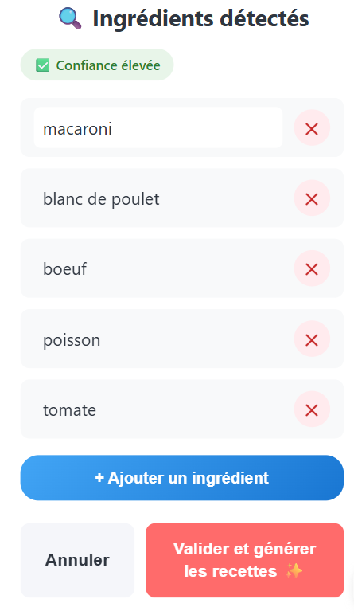
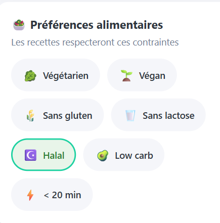
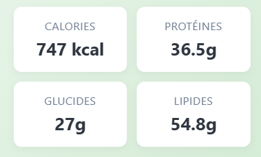
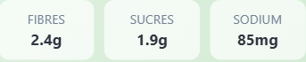
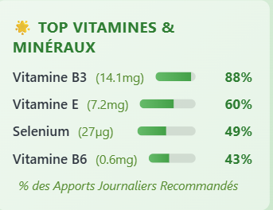
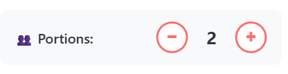
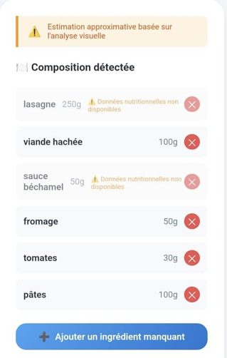
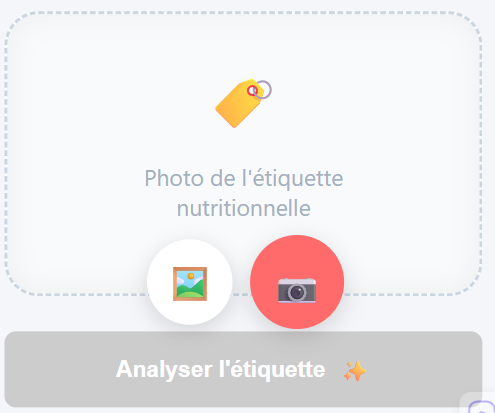
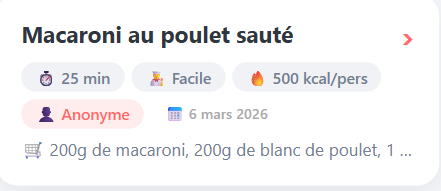
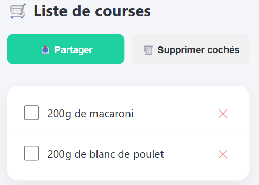

# Frigo Chef AI — Fiche application

**Version :** 2.1.0
**Date de mise à jour :** 6 mars 2026
**Plateforme :** Android (Apache Cordova)
**Type :** Application Mobile Hybride
**Modèle IA :** GPT-4o-mini (OpenAI)

---

## 📖 Table des Matières

1. [Contexte du Projet](#contexte-du-projet)
2. [Fonctionnalités Implémentées](#fonctionnalités-implémentées)
3. [Guide d&#39;Utilisation Complet](#guide-dutilisation-complet)
4. [Architecture Technique](#architecture-technique)
5. [Base de Données Nutritionnelle](#base-de-données-nutritionnelle)
6. [Installation &amp; Build](#installation--build)
7. [Dépannage](#dépannage)

---

## Contexte du projet

### Origine et objectif

**Problème résolu :**

> Comment transformer les ingrédients disponibles dans son frigo en recettes délicieuses, tout en ayant des informations nutritionnelles complètes et fiables ?

**Public Cible :**

- Personnes souhaitant réduire le gaspillage alimentaire
- Utilisateurs soucieux de leur nutrition
- Personnes manquant d'inspiration culinaire
- Étudiants et personnes actives (peu de temps, peu de budget)
- Amateurs de gastronomie cherchant des défis créatifs

### Valeur Ajoutée

**Frigo Chef se distingue par :**

1. **Intelligence Artificielle** : GPT-4o-mini pour recettes personnalisées + analyse visuelle
2. **Double Mode Chef** : "C'est la Hess" (simple/rapide) ou "Surprends-moi" (chef étoilé créatif)
3. **Nutrition Complète** : 260+ aliments locaux + 2M produits via OpenFoodFacts
4. **Validation Utilisateur** : Contrôle total sur les ingrédients détectés avant génération
5. **Analyse Multi-Mode** : Photo frigo, saisie manuelle, analyse assiette, scan code-barres, photo étiquette
6. **Filtres Alimentaires** : 7 régimes/contraintes (végétarien, végan, sans gluten, halal, etc.)
7. **Communauté** : Partage et découverte de recettes entre utilisateurs
8. **Hors Ligne** : Historique + base locale accessibles sans internet

### Technologie Choisie

**Cordova (Hybride) plutôt que Native**

| Avantages ✅                             | Inconvénients acceptés ⚠️          |
| ---------------------------------------- | -------------------------------------- |
| Développement rapide (HTML/CSS/JS)      | Performances légèrement inférieures |
| Multi-plateformes (Android + iOS future) | Taille APK un peu plus grande (~8 MB)  |
| Plugins riches (caméra, barcodescanner) |                                        |
| Maintenance simplifiée                  |                                        |

---

## Fonctionnalités implémentées

### 1. Génération de Recettes — Double Mode Chef

#### Sélecteur de mode (en haut de l'accueil)

Deux boutons permettent de choisir le style de génération avant toute action :

| Bouton                    | Mode        | Description                                                      |
| ------------------------- | ----------- | ---------------------------------------------------------------- |
| 🍳**C'est la Hess** | `basique` | Recettes simples, rapides, peu d'ustensiles, réconfortantes     |
| ⭐**Surprends-moi** | `etoile`  | Chef étoilé Michelin, créativité maximale, cuisines du monde |

Le mode sélectionné est conservé pendant toute la session. Un toast de confirmation s'affiche au changement.

---

#### A. Mode "Photo du Frigo"

**Flux complet :**

```
Photo frigo → IA détecte les ingrédients → Écran de validation → IA génère 2 recettes
```

**Étapes :**

1. L'utilisateur prend une photo de son frigo (via l'appareil photo Cordova)
2. GPT-4o Vision analyse l'image et retourne une liste JSON d'ingrédients + quantités + niveau de confiance
3. **Écran de validation** affiché (voir section dédiée)
4. Après confirmation → génération de 2 recettes selon le mode chef actif

**Détails techniques :**

- Image encodée en Base64 avant envoi
- Badge de confiance affiché : Haute / Moyenne / Faible
- Les condiments de base (sel, poivre) sont volontairement ignorés par le prompt de détection

#### B. Mode "Saisie Manuelle"

**Flux :**

```
Saisie texte → Passage direct à l'écran de validation → Génération recettes
```

- Champ textarea auto-redimensionnable
- Séparation des ingrédients par virgules (ex: `poulet, riz, tomate, oignon`)
- Même flux de validation que la photo

#### C. Écran de Validation des Ingrédients

Affiché entre la détection et la génération, quel que soit le mode d'entrée :



**Actions disponibles :**

- **Cliquer sur un input** → Modifier le nom ou la quantité d'un ingrédient
- **[×]** → Supprimer un ingrédient erroné
- **[+ Ajouter un ingrédient]** → Ajouter manuellement un ingrédient oublié
- **[Valider et générer les recettes]** → Lancer la génération avec les ingrédients finaux

---

### 2. Prompts IA selon le mode chef


#### Mode "C'est la Hess" 🍳

- Philosophie : simple, accessible, peu de matériel
- Techniques : poêle, casserole, four basique
- Ingrédients supplémentaires : uniquement les basiques (sel, poivre, huile, beurre, ail, oignon)
- Température IA : `0.6` (réponses cohérentes et classiques)
- Ton : pédagogue, encourage à éviter le gaspillage

#### Mode "Surprends-moi" ⭐

- Philosophie : chef étoilé Michelin, audace, créativité
- Exigence : les 2 recettes doivent être de **cuisines/techniques différentes**
- Techniques : wok, papillote, braisé, poché, mariné, rôti, fusion…
- Ingrédients supplémentaires : condiments créatifs, associations audacieuses
- Température IA : `0.9` (réponses très créatives et variées)
- Ton : chef passionné qui élève le niveau

---

### 4. Filtres Alimentaires & Régimes



7 filtres disponibles dans les **Réglages**, persistants entre les sessions :

| Filtre       | Icône | Exclusions appliquées                                                       |
| ------------ | ------ | ---------------------------------------------------------------------------- |
| Végétarien | 🥬     | Viande, poisson, fruits de mer, poulet, bœuf, porc, jambon, saucisse, bacon |
| Végan       | 🌱     | Tout ce dessus + œufs, lait, fromage, beurre, crème, yaourt, miel          |
| Sans gluten  | 🌾     | Pâtes, pain, farine de blé, semoule                                        |
| Sans lactose | 🥛     | Lait, fromage, beurre, crème, yaourt                                        |
| Halal        | ☪️   | Porc, bacon, jambon, alcool                                                  |
| Low carb     | 🥑     | Réduction glucides dans la génération                                     |
| < 20 min     | ⚡     | Recettes rapides uniquement                                                  |

**Comportement :**

- Les filtres actifs sont **injectés dans le prompt IA** sous forme de contraintes strictes avec liste explicite d'ingrédients interdits
- Les filtres actifs sont **affichés en badges** au-dessus des recettes générées
- Si un ingrédient interdit est présent, l'IA est instruite de ne pas l'utiliser et de proposer une alternative

---

### 4. Analyse nutritionnelle par recette

**Déclenchement :** Automatique après chaque génération de recettes.

**Pipeline de calcul :**

1. Extraction de la quantité en grammes pour chaque ingrédient (parsing regex avec patterns multiples)
2. Recherche dans la base locale (`food_db.json` — 260+ aliments)
3. Si non trouvé localement → Fallback API OpenFoodFacts
4. Calcul pondéré : `valeur = (nutriment/100g) × grammes_utilisés`
5. Somme par recette → division par nombre de portions

**Nutriments affichés par portion :**

*Macronutriments :*



- Calories (kcal) — avec total recalculé en temps réel si on change les portions
- Protéines (g), Glucides (g), Lipides (g)

*Essentiels :*



- Fibres (g), Sucres (g), Sodium (mg)

*Micronutriments (Top 4) :*



- Top 4 vitamines parmi : A, C, D, E, K, B1, B2, B3, B6, B9, B12
- Top 4 minéraux parmi : Ca, Fe, Mg, K, Zn, P, Sélénium
- % AJR avec barre de progression visuelle

*Index Glycémique :*

- Estimation : `Faible` / `Modéré` / `Élevé` + mini-explication

#### Contrôle des Portions



**Au changement de portion :**

- Quantités des ingrédients recalculées proportionnellement
- Titre nutrition mis à jour : "par portion · X portions au total"
- Calories : `X kcal/pers · Y kcal total` mis à jour en temps réel

---

### Page analyse

Accessible via l'onglet **Analyse** dans la barre de navigation.

#### A. Analyser une Assiette 🍽️

**Flux :**

```
Photo assiette → IA détecte aliments + quantités → Calcul nutrition → Affichage + édition
```

**Prompt IA optimisé pour :**

- Identifier chaque légume individuellement même s'ils sont mélangés
- Détecter les sauces et condiments
- Estimer les quantités en grammes (références standardisées)
- Retourner un niveau de confiance

**Interface de résultats :**



**Fonctionnalités d'édition en temps réel :**

- **[×]** → Supprimer un aliment → recalcul automatique
- **[➕ Ajouter un ingrédient manquant]** → Formulaire inline (nom + quantité en g) → ajout + recalcul
- Indicateur visuel si un aliment n'est pas dans la base

**Sauvegarde :** Automatique dans l'historique des analyses.

#### B. Analyser un produit

**3 modes d'accès :**

**Mode 1 — Scan Code-Barres (caméra)**


**Mode 2 — Saisie manuelle du code-barres**


**Mode 3 — Photo d'étiquette (fallback IA)**



**Données affichées (via OpenFoodFacts) :**

- Nom du produit + marque
- Valeurs nutritionnelles pour 100g
- Nutri-Score (A à E), Groupe NOVA (1 à 4)
- Liste des ingrédients + Allergènes

**Logique de verdict santé :**

| Critère             | Seuil        | Impact               |
| -------------------- | ------------ | -------------------- |
| Sucres               | > 22.5g/100g | ⛔ Très sucré      |
| Sel                  | > 1.5g/100g  | ⚠️ Trop salé      |
| Acides gras saturés | > 5g/100g    | ⚠️ Trop gras       |
| NOVA                 | 4            | ⛔ Ultra-transformé |
| Nutri-Score          | D ou E       | ⛔ Défavorable      |

**Badges verdict :** ✅ Sain / ⚠️ Limite / ⛔ Occasionnel

---

### 6. Page public

Accessible via l'onglet **Public** dans la barre de navigation.

#### Publication d'une recette

Depuis n'importe quelle recette générée, un bouton **🌍 Publier** permet de la partager. Elle apparaît attribuée à "Anonyme" avec la date de publication. Une recette ne peut pas être publiée deux fois.

#### Affichage en accordéon

Les recettes communautaires s'affichent en **cartes accordéon repliées** :

**En-tête (toujours visible) :**



**Corps dépliable (clic sur la carte) :**

- Liste complète des ingrédients avec cases à cocher + bouton [+] liste de courses
- Étapes de préparation (avec minuteurs automatiques)
- Astuce du chef
- Boutons : ❤️ Favoris, 📤 Partager

**Comportement :**

- Un seul accordéon ouvert à la fois (fermeture automatique des autres)
- Tri par date de publication (plus récentes en premier)

---

### 7. Gestion utilisateur

#### A. Favoris

- Ajout/suppression depuis n'importe quelle recette (bouton ❤️)
- Accessibles hors ligne — Onglet **Favoris**
- Stockés en `localStorage`

#### B. Historique

- 10 dernières sessions de génération conservées
- Chaque entrée : ingrédients utilisés, recettes, nutrition, date
- Bouton **"Refaire"** : relance la génération avec les mêmes ingrédients
- Indicateur "🔌 Hors ligne" si pas de connexion
- Onglet **Historique**

#### C. Liste de courses



- Ajout depuis une recette (bouton [+] à côté de chaque ingrédient)
- Anti-doublon automatique
- Cochage des articles achetés
- Onglet **Courses**

#### D. Minuteurs de cuisson


- Détection automatique des durées dans les étapes ("cuire 20 minutes", "laisser mijoter 1h")
- Bouton minuteur généré automatiquement
- Décompte en temps réel — plusieurs minuteurs simultanés
- Son (application ouverte) + Notification (application fermée et ouverte) via le plugin systèmecordova-plugin-local-notification

#### E. Partage de recettes

- Export texte formaté via API native de partage (WhatsApp, Email, SMS…)
- Inclut : nom, ingrédients, étapes, astuce chef, valeurs nutritionnelles

---

### 8. Réglages

- **Filtres alimentaires** : 7 toggles persistants
- **Mode sombre** : Bascule dark theme complet
- Sauvegardés en `localStorage` et rechargés au démarrage

---

### 9. Mode hors ligne

| Fonctionnalité                     | Hors ligne               |
| ----------------------------------- | ------------------------ |
| Historique (10 dernières sessions) | ✅                       |
| Favoris                             | ✅                       |
| Calcul nutrition (base locale)      | ✅                       |
| Minuteurs                           | ✅                       |
| Liste de courses                    | ✅                       |
| Génération de recettes            | ❌ (nécessite OpenAI)   |
| Fallback OpenFoodFacts              | ❌ (nécessite internet) |
| Lookup produit (code-barres)        | ❌ (nécessite internet) |

---

## Guide d'utilisation complet

### Générer des recettes (Photo frigo)

```
1. Choisir mode chef : [🍳 C'est la Hess] ou [⭐ Surprends-moi]
2. (Optionnel) Activer filtres dans Réglages
3. Cliquer sur l'appareil photo → Prendre la photo
4. Vérifier/modifier les ingrédients détectés
5. Cliquer [✅ Valider & Cuisiner]
6. 2 recettes s'affichent avec nutrition complète
```

### Générer des recettes (Saisie manuelle)

```
1. Saisir les ingrédients dans le champ texte (séparés par virgules)
2. Cliquer [Générer les Recettes]
3. Vérifier/modifier sur l'écran de validation
4. Valider → Recettes générées
```

### Analyser une assiette

```
Onglet Analyse → "Analyser une Assiette"
→ Prendre une photo (vue du dessus, bien éclairé)
→ Attendre l'analyse IA (~10s)
→ Voir les aliments détectés + nutrition totale
→ Corriger si nécessaire (ajouter/retirer des items)
```

### Scanner un produit

```
Onglet Analyse → "Analyser un Produit"
→ Option 1 : [📷 Scanner] → Pointer la caméra vers le code-barres
→ Option 2 : Saisir le code-barres manuellement (8-13 chiffres) + [Rechercher]
→ Option 3 : [📷 Photo étiquette] → Photo du tableau nutritionnel

→ Résultats : nutrition / Nutri-Score / NOVA / allergènes / verdict
```

### Page communauté

```
Publier une recette :
→ Depuis une recette générée → Bouton [🌍 Publier]

Consulter les recettes :
→ Onglet "Public"
→ Cliquer sur une carte pour déplier les détails
→ ❤️ Favoris / 📤 Partager / [+] Ajouter ingrédients à la liste
```

### Configurer les filtres

```
Onglet Réglages → Section "Filtres alimentaires"
→ Activer/désactiver : Végétarien, Végan, Sans gluten, Sans lactose, Halal, Low carb, < 20 min
→ Les filtres s'appliquent automatiquement à la prochaine génération
```

---

## Architecture technique

### Stack technologique

| Couche             | Technologie                                                                |
| ------------------ | -------------------------------------------------------------------------- |
| Frontend           | HTML5 / CSS3 / JavaScript ES6+ (Vanilla)                                   |
| Mobile             | Apache Cordova 12.0.0                                                      |
| IA                 | OpenAI GPT-4o-mini                                                         |
| Nutrition locale   | `food_db.json` (260+ aliments)                                           |
| Nutrition produits | OpenFoodFacts API v2                                                       |
| Stockage           | `localStorage` (JSON)                                                    |
| Plugins Cordova    | Camera, Device, Network, Barcodescanner, Splashscreen, Android Permissions |

### Modules principaux

**`www/js/index.js`** (~3 400 lignes)

- Gestion complète UI / vues / navigation
- Appels API OpenAI (recettes, détection ingrédients, analyse assiette, lecture étiquette)
- Double mode chef (basique / étoile) avec prompts distincts
- Filtres alimentaires (construction prompt + exclusions explicites)
- Écran de validation des ingrédients
- Contrôle des portions (recalcul ingrédients + calories en temps réel)
- Minuteurs multi-simultanés avec détection automatique
- Historique, Favoris, Liste de courses
- Communauté (publication + affichage accordéon)
- Mode hors ligne

**`www/js/nutrition.js`** (~670 lignes)

- `calculateRecipeNutrition()` : pipeline complet de calcul
- `findFood()` / `findFoodWithFallback()` : recherche locale + OpenFoodFacts
- `getTopMicronutrients()` : sélection Top 4 vitamines/minéraux + % AJR
- `estimateGlycemicIndex()` : heuristique IG
- `renderNutritionCard()` : rendu HTML avec `data-calories-per-serving` pour recalcul dynamique
- Normalisation sodium automatique (mg ↔ g)

**`www/js/openfoodfacts.js`** (~200 lignes)

- `scanBarcode()` : plugin Cordova barcodescanner
- `getProductByBarcode(barcode)` : API OFF `/api/v2/product/`
- `searchProducts(query)` : recherche textuelle (fallback)
- `mapOFFProductToNutrition(product)` : normalisation des clés
- `computeHealthVerdict()` : scoring santé (sucres, sel, graisses, NOVA, Nutri-Score)
- Cache mémoire des résultats OFF

**`www/js/food_db.json`** (~6 000 lignes)

- 260+ aliments de base
- Valeurs USDA / ANSES / Ciqual
- Aliases pour matching flexible

### Navigation (7 onglets)

| Onglet     | Icône | Vue                                           |
| ---------- | ------ | --------------------------------------------- |
| Cuisiner   | 🏠     | Accueil + sélecteur mode chef + génération |
| Public     | 🌍     | Communauté (accordéon)                      |
| Favoris    | ❤️   | Recettes sauvegardées                        |
| Analyse    | 🔬     | Assiette + Produit (scan/manuel/photo)        |
| Courses    | 🛒     | Liste de courses                              |
| Historique | 📋     | Historique des sessions                       |
| Réglages  | ⚙️   | Filtres alimentaires + Dark mode              |

---

## Base de données nutritionnelle

### 260+ Aliments locaux

**Sources :** USDA FoodData Central + Table Ciqual ANSES (France)

**Catégories couvertes :**

- 🥩 Protéines animales (12) : Poulet, Bœuf, Dinde, Porc, Agneau, Saumon, Thon, Cabillaud, Sardines, Maquereau, Crevettes, Œuf
- 🌾 Céréales & féculents (11) : Riz blanc, Riz complet, Riz basmati, Pâtes, Pain blanc, Pain complet, Quinoa, Boulgour, Semoule, Orge, Avoine
- 🫘 Légumineuses (4) : Lentilles, Pois chiches, Haricots rouges, Tofu
- 🥦 Légumes (35+) : dont Choux romanesco, Butternut, Poireau, Blette, Artichaut, Radis noir, Topinambour, Kale, Bok choy, etc.
- 🍎 Fruits (25+) : dont Figue, Litchi, Goyave, Fruit de la passion, Carambole, Physalis, etc.
- 🥑 Oléagineux & graines (12+) : Amandes, Noix, Cajou, Pistaches, Graines de sésame, Chia, Lin, etc.
- 🧀 Laitiers (8+) : Lait, Fromage (plusieurs types), Yaourt, Fromage blanc, etc.
- 🫒 Matières grasses (4) : Huile d'olive, Huile de tournesol, Beurre, Crème fraîche
- 🧄 Aromates & épices (20+) : Ail, Gingembre, Échalote, Citron, Persil, Basilic, Curcuma, Piment, Curry, Sumac, Za'atar, Harissa, etc.
- 🍫 Autres (15+) : Chocolat noir, Cacao en poudre, Miso, Levure nutritionnelle, etc.

**Format de chaque entrée :**

```json
{
  "name": "poulet",
  "aliases": ["blanc de poulet", "filet de poulet", "chicken"],
  "per100g": {
    "calories": 165,
    "proteines": 31,
    "glucides": 0,
    "lipides": 3.6,
    "fibres": 0,
    "sucres": 0,
    "sodium": 0.08,
    "vitamines": { "B3": 13.7, "B6": 0.6, "B12": 0.3 },
    "mineraux": { "phosphore": 220, "selenium": 27, "zinc": 1.3 }
  },
  "gi": "low"
}
```

### Stratégie de matching

1. **Recherche exacte** sur `name`
2. **Recherche par alias** sur `aliases[]`
3. **Recherche partielle** (contenance dans les deux sens)
4. **Normalisation** : minuscules, suppression accents
5. **Fallback OpenFoodFacts** : recherche textuelle si toujours introuvable

### Fallback OpenFoodFacts (+2M Produits)

- Utilisé si aliment non trouvé localement
- Utilisé pour tous les produits industriels (scan code-barres)
- Cache mémoire pour éviter les appels répétés
- Correction automatique sodium : si valeur > 10g/100g → division par 1000

---

## Installation & build

### Prérequis

```bash
node -v          # Node.js 24.6.0+
cordova -v       # Cordova CLI (npm install -g cordova)
java -version    # JDK 17+
# Android Studio + SDK configuré ($ANDROID_HOME)
```

### Installation

```bash
git clone https://github.com/MilFhey/FrigoChef.git
cd FrigoChef
npm install
cordova platform add android
cordova platform add browser
```

### Configuration clé API OpenAI

Éditer `www/js/index.js` — objet `CONFIG` (~ligne 12) :

```javascript
const CONFIG = {
  API_KEY: "VOTRE_CLE_API_ICI",
  // ...
};
```

### Build

```bash
# Navigateur (développement)
cordova run browser

# Android (debug)
cordova build android

# APK généré :
# platforms/android/app/build/outputs/apk/debug/app-debug.apk
```

---

## Statistiques du Projet

```
Lignes de Code Total :  ~9 000
  - JavaScript (index.js)  :  ~3 400
  - JavaScript (nutrition) :  ~670
  - JavaScript (OFF)       :  ~200
  - CSS                    :  ~2 700
  - HTML                   :  ~450
  - JSON (food_db)         :  ~6 000

Base Nutrition Locale    :  260+ aliments
Base OFF (fallback)      :  +2 000 000 produits
Modèle IA                :  GPT-4o-mini
Plugins Cordova          :  6
Taille APK (debug)       :  ~8 MB
```

---

## Cas d'usage réels

**Scénario 1 — L'étudiant pressé**

> "J'ai du poulet et du riz, que faire ?"
> → Photo frigo → Mode "C'est la Hess" → 2 recettes rapides en 30s

**Scénario 2 — Le Foodie créatif**

> "J'ai les mêmes ingrédients, mais je veux épater mes amis"
> → Photo frigo → Mode "Surprends-moi" → Recettes fusion créatives et variées

**Scénario 3 — Le suivi nutritionnel**

> "Combien de calories dans ce plat au restau ?"
> → Analyse → Assiette → Photo → Estimation nutrition en temps réel

**Scénario 4 — Le consommateur averti**

> "Ce yaourt est-il vraiment sain ?"
> → Analyse → Produit → Scanner → Nutri-Score + NOVA + verdict

**Scénario 5 — Le régime végan**

> "Je suis végan, quelles recettes avec ce que j'ai ?"
> → Réglages → Activer "Végan" → Photo frigo → Recettes 100% végétales garanties

**Scénario 6 — La découverte communautaire**

> "Je cherche de l'inspiration sans utiliser l'IA"
> → Onglet Public → Parcourir les recettes partagées → Déplier pour voir les détails

---

**Date de mise à jour :** 6 mars 2026
**Version Application :** 2.1.0
**Status :** Production Ready ✅
